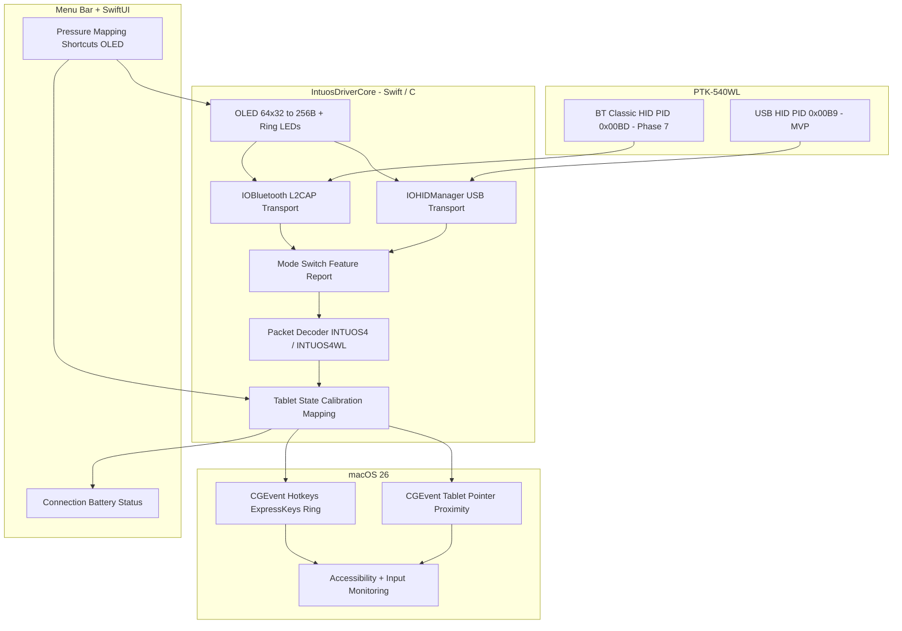

# Native Apple Silicon macOS Driver Plan: Wacom Intuos4 Wireless (PTK-540WL)

## 1. Goal

Build a **native arm64, user-space** driver and companion app for the **Wacom Intuos4 Wireless (PTK-540WL)** on **macOS 26 only** (target machine: macOS 26.4.1).

- Real HID I/O — not Rosetta, not the legacy Intel installer, not KEXT workarounds.
- MVP priority: **USB first**, then Bluetooth Classic.
- Drawing targets: **Adobe Photoshop / Illustrator** plus broad pro apps (Krita, Clip Studio, Affinity, Apple Notes).

Legacy reference in-tree: `Lates known driver not for Apple silicon/WacomTablet_6.3.41-2.dmg` (v6.3.41-2). That package is `hostArchitecture="x86_64"`, requires restart, ships `SiLabsUSBDriver64.kext`, daemons, and a deprecated `.prefPane`.

Related note: `driver.md` — native connection on Apple Silicon, not simulation of the old driver.

---

## 2. Decisions (locked)

| Decision | Choice |
| :--- | :--- |
| Architecture | Native `arm64` only (no universal / Intel requirement) |
| Minimum OS | **macOS 26** only |
| Driver model | User-space only (`IOHIDManager`, later `IOBluetooth` L2CAP). No KEXT, no SIP off |
| MVP transport | **USB first** (PID `0x00B9`), then Bluetooth Classic (PID `0x00BD`) |
| App integration | Real tablet events for **Adobe + broad pro apps** (not cursor-only MVP) |
| Protocol source of truth | **linuxwacom** (`wacom_wac.c` / `INTUOS4` / `INTUOS4WL`) + live USB capture; legacy binary only for OLED/report ID hints |
| UI | Menu bar app + SwiftUI settings (not `.prefPane`) |

---

## 3. Legacy Intel vs modern driver

| Feature | Legacy 6.3.41-2 | This project |
| :--- | :--- | :--- |
| Arch | `x86_64` only | Native `arm64` |
| Installer | `hostArchitecture="x86_64"`, restart required | Ad-hoc or notarized app / optional LaunchAgent |
| Driver model | KEXT (`SiLabsUSBDriver64.kext`) + daemons + privileged helpers | User-space HID + event injection |
| Pen path | Proprietary tablet daemon | `CGEvent` tablet pointer / proximity (full fields for Adobe) |
| Wireless | Legacy stack + system BT HID | **Deferred:** BT Classic via `IOBluetoothDevice` L2CAP (not CoreBluetooth) |
| ExpressKeys / ring | Daemon routing | Swift state engine + configurable shortcuts |
| OLED | `CPTKWLImageConverter` path | 64×32 → 256-byte buffers via HID output (linuxwacom-aligned) |
| UI | `.prefPane` (dead on modern macOS) | Menu Bar + SwiftUI |
| Security | Unsigned KEXT / SIP friction | Accessibility + Input Monitoring TCC only |

**Note:** `SiLabsUSBDriver64.kext` is not required for the pen/pad MVP (likely serial/firmware accessory path). Out of scope.

---

## 4. Hardware: PTK-540WL

| Item | Value |
| :--- | :--- |
| VID | `0x056A` (Wacom) |
| USB PID | `0x00B9` |
| Bluetooth PID | `0x00BD` |
| BT name | `PTK-540WL` |
| BT stack | **Bluetooth Classic 2.1+EDR, HID Profile** (not BLE) |
| Active area | 8.0" × 5.0" (203.2 × 127.0 mm) |
| Coordinates | Max X = `40640`, Max Y = `25400` (5080 LPI) |
| Pressure | 2048 levels (0–2047) |
| Tilt | ±60° (`-64`…`+63` on X/Y in Intuos4 encoding) |
| Controls | 8 ExpressKeys (each 64×32 mono OLED), Touch Ring (72 steps, 4 mode LEDs, center button) |
| Pairing | Discoverable ~180 s after pairing button; legacy PIN `0000` if prompted |

---

## 5. Architecture



**Process shape**

- Single **arm64** macOS app (Menu Bar extra + Settings window).
- Embedded library `IntuosDriverCore` (Swift; thin C for HID helpers if needed).
- Optional LaunchAgent after MVP for login start.
- No kernel extension; no DriverKit required for USB MVP.

---

## 6. Protocol notes (must not skip)

### 6.1 Mode switch (USB and BT)

After every open / reconnect, send Wacom **feature report mode switch** so the device leaves generic HID mouse mode and streams full Wacom reports.

- USB: HID `SET_REPORT` feature (same semantic as linuxwacom init).
- BT Classic: on HID Control L2CAP (PSM `0x0011`), bytes equivalent to `{0x53, 0x02, 0x02}` (SET_REPORT | Feature, report/mode payload per capture verification).
- Re-issue after **every** BT L2CAP reconnect — tablet resets mode on new session.

### 6.2 USB pen / pad (MVP)

- Match linuxwacom **INTUOS4** family parsing for PID `0x00B9`.
- Pen: X/Y, pressure, tilt, tip/eraser, barrel buttons, proximity, **tool ID** (out-of-band proximity/tool packets matter).
- Pad: ExpressKeys bitmask, Touch Ring position/mode, center button.
- Do not invent layouts — implement against linuxwacom + recorded fixtures.

### 6.3 Bluetooth Classic (Phase 7 only)

- **Not CoreBluetooth** (that is BLE). Use `IOBluetoothDevice` + L2CAP PSM `0x0011` (control) and `0x0013` (interrupt).
- BT reports are **batched**: report IDs `0x03` (~22 bytes, 2 pen frames) and `0x04` (~32 bytes, 3 pen frames) per linuxwacom `wacom_intuos_bt_irq`.
- Battery: status nibble + `batcap_i4[]` lookup (`{1,15,30,45,60,70,85,100}`), charging / AC flags — not a raw 0–100 byte alone.
- Risk: system `IOBluetoothHIDDriver` may claim the device; plan exclusive open / user steps / contention handling in Phase 7.

### 6.4 OLED / LEDs

- Each key: **64×32** 1-bit image → **256-byte** payload (linuxwacom / community Intuos4 WL path).
- Brightness and Touch Ring mode LEDs via HID output / feature reports (confirm IDs from capture + linuxwacom).
- Legacy `CPTKWLImageConverter` is a hint only; golden buffers from hardware beats guessing “nibbilize”.

### 6.5 Event injection (Adobe-critical)

- Emit `kCGEventTabletPointer` and `kCGEventTabletProximity` with full tablet fields (device ID, pointer type tip vs eraser, pressure normalized correctly, tilt, absolute X/Y).
- Avoid double-driving a plain mouse path that fights tablet events in Photoshop/Illustrator.
- Expect **app-specific iteration** in Phase 3 (pressure scale, proximity enter/leave ordering, tool type).
- ExpressKeys / ring → configurable keyboard shortcuts via `CGEvent` key events (needs Input Monitoring / Accessibility as applicable).

---

## 7. Phased implementation

### Phase 0 — Spec and capture harness

- Write internal protocol cheat-sheet from linuxwacom (`INTUOS4`, `INTUOS4WL`) + VID/PID table.
- Build a small USB HID sniffer (same transport stack as the driver) to record raw reports: pen hover, press, eraser, keys, ring, OLED writes if observable.
- Store golden fixtures under something like `Fixtures/usb/` for unit tests.
- Optional read-only strings/symbol pass on legacy `WacomTabletDriver` for OLED report IDs only.

**Exit:** Documented packet layouts + at least one real USB capture set from the PTK-540WL.

### Phase 1 — Scaffold and USB transport (`IntuosDriverCore`)

- Xcode (or SPM + app target), **macOS 26**, **arm64**.
- `IOHIDManager` discovery for VID `0x056A`, PID `0x00B9`.
- Connect / disconnect lifecycle; clear logging.
- Send **mode switch** immediately after open.
- Callback path delivering raw report bytes to the decoder stub.

**Exit:** Plug in USB → app logs continuous Wacom reports (not generic mouse-only junk).

### Phase 2 — Packet decoder and state engine

- Pen decoder: X/Y, pressure 0–2047, tilt, tip/eraser, barrel, proximity, tool ID.
- Pad decoder: 8 ExpressKeys, ring (72), mode, center button.
- Coordinate transform: tablet → target display(s); preserve aspect / full desktop / single display options.
- Pressure curve (user-editable LUT).
- Unit tests fed by Phase 0 fixtures.

**Exit:** Decoder tests green; live state visible in debug UI or logs.

### Phase 3 — Event synthesis (Photoshop / Illustrator gate)

- Inject tablet pointer + proximity events with sub-pixel positioning where applicable.
- Distinct tip vs eraser tool identity.
- Manual matrix: Photoshop, Illustrator, then Krita, Clip Studio, Affinity, Notes.
- Fix pressure dead zone, hover, and click-through issues per app.

**Exit:** Pressure-sensitive strokes work in **Photoshop and Illustrator** over USB; eraser and barrel buttons behave sanely.

### Phase 4 — ExpressKeys and Touch Ring

- Configurable bindings (defaults: Undo/Redo, brush size `[` `]`, zoom, etc.).
- Ring rotation → scroll/zoom/brush size by mode; center toggles mode.
- Drive ring mode LEDs when output reports are known.

**Exit:** Keys and ring usable while drawing without leaving the app.

### Phase 5 — OLED controller

- Render labels/icons to 64×32 1-bit; pack to 256 bytes; send per-key HID updates.
- Optional brightness control.
- Tests against golden frames.

**Exit:** Each ExpressKey shows a correct label/icon on device.

### Phase 6 — Menu bar app and settings UI

- Menu bar: connection state; battery placeholder until BT (USB may still expose charge state if present in reports).
- Settings: pressure curve, display mapping, key/ring bindings, OLED text.
- First-run TCC guidance (Accessibility, Input Monitoring).
- Optional “Open at login”.

**Exit:** Daily-driver UX without Console.app.

### Phase 7 — Bluetooth Classic

- Pairing documentation (button, `PTK-540WL`, PIN `0000` if needed).
- `IOBluetoothDevice` L2CAP control/interrupt; mode switch on every reconnect.
- Unwrap BT batch reports `0x03` / `0x04`; tool-ID proximity handling.
- Battery via `batcap_i4` + charging flags; menu bar percentage.
- Mitigate contention with system BT HID driver.

**Exit:** Wireless pen pressure works after pair/sleep/wake; battery visible.

### Phase 8 — Polish and release hygiene

- Code signing (ad-hoc for personal use, or Developer ID + notarization if distributing).
- Crash/reconnect resilience; sleep/wake; USB unplug during stroke.
- Automated parser + OLED tests in CI if desired.
- Short README: install, permissions, USB vs BT, troubleshooting.

**Exit:** Reliable personal daily use on macOS 26 Apple Silicon.

---

## 8. Verification strategy

### Automated

- Packet parser unit tests from recorded USB (and later BT) fixtures.
- Coordinate/pressure curve math tests.
- OLED 256-byte golden frame tests.

### Manual checklist

1. **USB PnP** — attach PTK-540WL; auto-attach; mode switch; reports flow.
2. **Adobe** — Photoshop + Illustrator pressure, tilt, eraser, hover.
3. **Other apps** — Krita, Clip Studio, Affinity, Notes.
4. **Mapping** — single and multi-display.
5. **ExpressKeys / ring** — shortcuts + mode LEDs.
6. **OLED** — labels update and persist across reconnect as designed.
7. **BT (Phase 7+)** — pair, draw, sleep/wake, battery, reconnect mode switch.
8. **Permissions** — fresh user account path: TCC prompts and recovery docs.

---

## 9. Risks

| Risk | Impact | Mitigation |
| :--- | :--- | :--- |
| Adobe tablet event quirks | High | Phase 3 gate on PS/AI; iterate event fields; compare with known-good tablet behavior |
| Wrong BT API (BLE vs Classic) | High if done early | BT deferred; L2CAP only; never CoreBluetooth for this model |
| System BT HID steals device | High on Phase 7 | Exclusive open research; user pairing steps; possible IOKit claiming strategy |
| OLED report IDs wrong | Medium | Capture + linuxwacom; no guess-only implementation |
| No official Wacom AS support for this model | Medium | linuxwacom + hardware capture as spec |
| macOS 26-only APIs | Low | Accept narrower OS; document if back-port ever needed |
| Competing mouse + tablet events | Medium | Suppress redundant mouse path; test click/drag in Adobe |

---

## 10. Out of scope

- Running or packaging legacy 6.3.41 under Rosetta as the product.
- `SiLabsUSBDriver64.kext` / SIP disable workflows.
- Wacom Desktop Center, Firmware Updater, or full Apple Events “Driver Request Interface” compatibility for third-party plugins that expect the official daemon.
- BLE / `CoreBluetooth` transport (wrong generation for PTK-540WL).
- Windows/Linux ports.
- Support for other Intuos4 PIDs unless needed as parser reference.

---

## 11. Suggested first delivery (MVP definition)

**USB MVP is done when:**

1. PTK-540WL on USB is discovered and mode-switched on macOS 26 arm64.
2. Pen moves with **pressure and tilt** in **Photoshop and Illustrator**.
3. Tip vs eraser work.
4. Basic ExpressKey shortcuts work.
5. Menu bar shows connected/disconnected.

OLED polish and Bluetooth are **post-MVP** (Phases 5 and 7).

---

## 12. Repo layout (target)

```text
Intuos driver/
  driver.md                 # original goal note
  driver_build.md           # this plan
  Lates known driver.../    # legacy DMG reference only
  IntuosDriver/             # Xcode project (to create)
    IntuosDriverCore/       # transport, parser, state, OLED, events
    IntuosDriverApp/        # Menu bar + SwiftUI
    Fixtures/               # golden USB/BT captures
    Tests/                  # parser + OLED unit tests
```

---

## 13. Immediate next steps

1. Create Xcode project scaffold (macOS 26, arm64) + `IntuosDriverCore` targets.
2. Implement Phase 0 sniffer + Phase 1 USB open/mode-switch/logging.
3. Capture fixtures from the physical PTK-540WL.
4. Implement Phase 2 decoder against linuxwacom + fixtures.
5. Phase 3 Adobe validation loop until PS/AI pressure is trustworthy.

Do not start Bluetooth or OLED until USB pen events are solid in Adobe apps.
